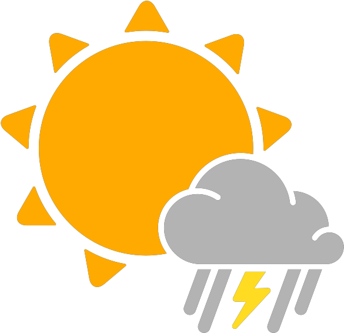

# rust-weather

Simple weather cli written in [rust](https://www.rust-lang.org/) which uses your current location

## Setup

Make sure you have [rust](https://www.rust-lang.org/) installed on your machine by following the [getting started guide](https://www.rust-lang.org/learn/get-started)

Get an API key from [OpenWeather](https://openweathermap.org/)

## Instructions

* Clone this repository `git clone git@github.com:thomaschaplin/rust-weather.git`
* Change directory `cd rust-weather`
* Create a `.env` file with your OpenWeather API key (see below example)
* Build the application `cargo build`
* Run the application `cargo run`

Example `.env` file
```
API_KEY=1234567890
```

### Final Build

* Build the application in release mode `cargo build --release`
* Execute the `rust-weather` binary file found in `target/release/rust-weather`

#### Example output:

```
City: London
Country Code: GB
Humidity: 87%
Weather Description: light rain
Wind Speed: 15kmh
Wind Direction: South
Temperature: 15°C
Minimum Temperature: 15°C
Maximum Temperature: 16°C
Feels Like: 14°C
Sunrise: 2020-09-30 05:59:58 UTC
Sunset: 2020-09-30 17:40:41 UTC
```

# Docker Setup

Build
```
docker build --rm -f Dockerfile -t thomaschaplin:rust-weather .
```

Run
```
docker run --rm -it thomaschaplin:rust-weather
```

---

[Weather](https://www.clipartkey.com/view/wbJhxi_transparent-rain-vector-png-sunny-weather-icon-png/) graphic by <a href="https://www.clipartkey.com/upic/5217/">Kineri Luis</a> from ClipArtKey.
